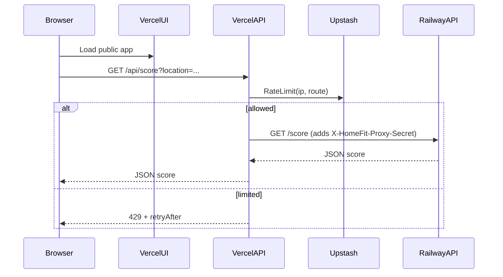

### Goals

- Keep the app **public-facing** (Product Hunt friendly) while making the backend **non-abusable** under sudden traffic.
- Avoid quota blowups (SchoolDigger / OSM / Nominatim / GEE) and prevent cheap DoS vectors.

### Key decisions (locked)

- **API exposure**: proxy through Vercel API routes (browser never calls Railway directly).
- **Rate limiting**: Vercel middleware + Upstash Redis.
- **Streaming**: disable SSE for launch week; use non-streaming `/score` only.

### Proposed request flow

### Backend hardening on Railway (FastAPI)

- **Add a proxy-secret check** for sensitive routes so only Vercel can call them.
  - Apply to: `/score`, `/batch` (if kept), `/cache/clear`, `/cache/stats`, `/telemetry`.
  - Implement as a small dependency/middleware in [`/Users/adamwright/home-fit/main.py`](/Users/adamwright/home-fit/main.py).
- **Disable or protect admin/diagnostic endpoints** for launch week.
  - Today they’re open (e.g. `/cache/clear`, `/telemetry`).
- **Fix batch size validation**.
  - Current model lets the client supply `max_batch_size` (see `BatchLocationRequest` in [`/Users/adamwright/home-fit/main.py`](/Users/adamwright/home-fit/main.py)).
  - Enforce a server constant (e.g. `MAX_BATCH_SIZE = 10`) regardless of request body.
- **Gate schooling**.
  - Default `ENABLE_SCHOOL_SCORING = False` for launch week and require an explicit server-side “premium allow” flag/code.
  - This avoids SchoolDigger’s free-plan collapse.
- **Tighten CORS**.
  - Currently `allow_origins=["*"] `and `allow_credentials=True` (see [`/Users/adamwright/home-fit/main.py`](/Users/adamwright/home-fit/main.py)).
  - For proxy mode, CORS can be restricted to your Vercel domain(s) or removed for protected routes.

### Vercel proxy + rate limiting

- **Create Vercel API routes** (Next.js) that forward to Railway:
  - `/api/score` → Railway `/score`
  - (Optional later) `/api/batch` → Railway `/batch`
- **Store secrets in env**:
  - Vercel: `RAILWAY_API_BASE_URL`, `HOMEFIT_PROXY_SECRET`, Upstash credentials.
  - Railway: `HOMEFIT_PROXY_SECRET` (same value).
- **Add rate limiting in Vercel middleware**:
  - Per-IP limits by route (example targets for launch week):
    - `/api/score`: 10/min/IP with short burst, plus a tighter concurrent-inflight cap.
    - Block obvious bots via UA/ASN heuristics where possible.

### Frontend adjustments

- Update API calls in [`/Users/adamwright/home-fit/frontend/lib/api.ts`](/Users/adamwright/home-fit/frontend/lib/api.ts) to hit **`/api/score`** (same-origin) instead of `NEXT_PUBLIC_API_URL`.
- Remove/disable the SSE path in UI for launch week; keep the loading UX but drive it from a single `/api/score` call.
- Add “Premium waitlist” UX copy for schooling:
  - If `enable_schools=true` is requested, show a gated message and do not call the premium backend path.

### Observability + launch operations

- Add a minimal **request log** at the proxy layer (counts, latency, 429s, upstream errors), not full addresses.
- Define an incident playbook:
  - Flip switches via env: disable batch, disable premium, raise rate limits, or hard-block by IP.

### Pre-launch validation

- Load test at the proxy layer (light): confirm 429 behavior and that Railway is unreachable directly.
- Validate that `/cache/clear` and `/telemetry` are inaccessible without the proxy secret.

### Files likely touched

- Backend: [`/Users/adamwright/home-fit/main.py`](/Users/adamwright/home-fit/main.py)
- Frontend: [`/Users/adamwright/home-fit/frontend/lib/api.ts`](/Users/adamwright/home-fit/frontend/lib/api.ts)
- New in frontend (Vercel): `frontend/pages/api/score.ts` or `frontend/app/api/score/route.ts` (depending on your Next.js structure), plus `frontend/middleware.ts`.